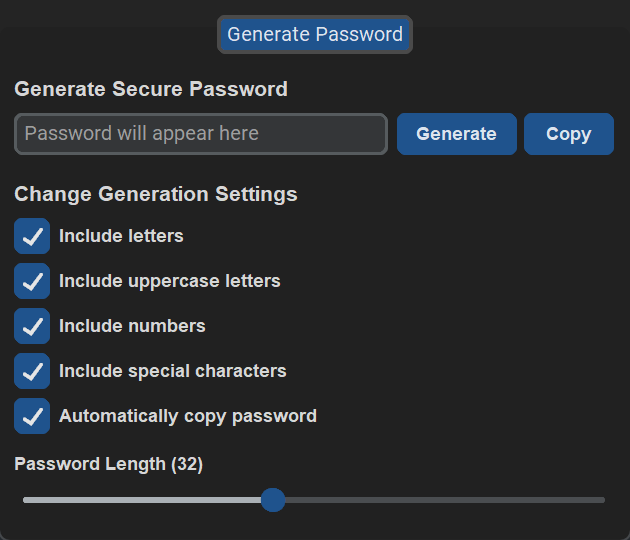

[**Інструкція Українською**](./docs/README_UA.md)

  

<h1 align="center">Strong Password Generator</h1>

### Table of contents

- [Table of contents](#table-of-contents)
- [Overview](#overview)
- [Installation and Usage](#installation-and-usage)
- [Features](#features)
- [Screenshots](#screenshots)
- [Links](#links)
- [License](#license)

### Overview

Strong Password Generator is a simple and easy-to-use password generator. It allows the user to choose the length of the password, whether to include uppercase letters, lowercase letters, numbers, and/or symbols, and whether to automatically copy the password to the clipboard. It is built using Python's [CustomTkinter](https://github.com/TomSchimansky/CustomTkinter) library.

### Installation and Usage

1. Download the [latest version](https://github.com/seesmof/strong-password-generator/archive/refs/tags/v1.0.0.zip) of the program and unzip it.
   1. Make sure you have Python 3.10 or higher installed on your computer. If not, please download the latest version of Python from [here](https://www.python.org/downloads/)
2. Run the program using `Run.vbs` file.
3. Enjoy!

### Features

- Option to automatically copy password to clipboard
- Save and load settings data
- Auto generate password on startup
- Clean and easy to use interface

### Screenshots

### Links

- [Icon](https://www.flaticon.com/)

### License

This project is licensed under the [MIT License](./LICENSE).

<a href="#readme-top"><strong>Back to top</strong></a>

